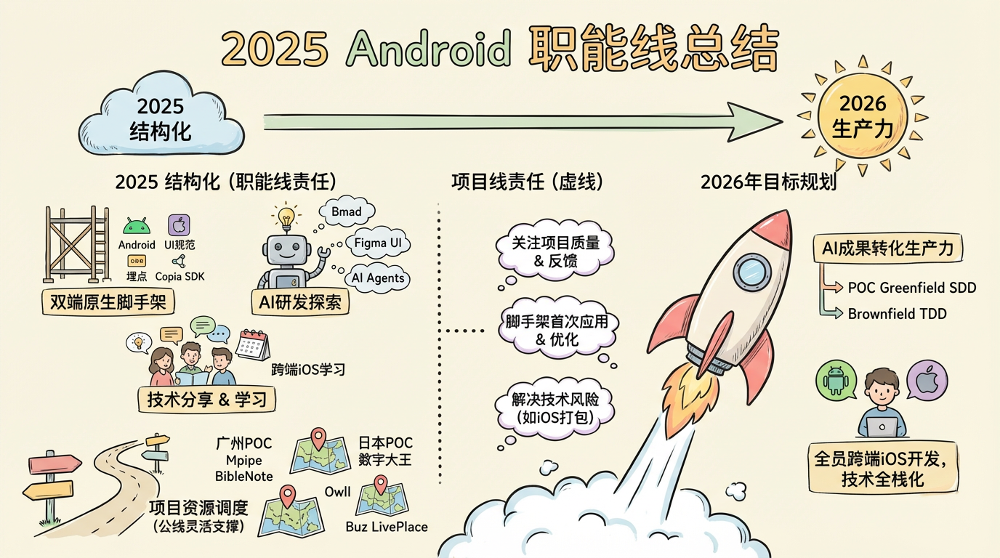

# AI Prompts for 内容提炼信息卡
> 推荐使用Nano Banana Pro 生成

## Option 1
```
请根据输入内容提取核心主题与要点，生成一张卡通风格的信息图：
- 采用手绘风格，（横版16:9）构图
- 加入少量简洁的卡通元素，图标或画像，增强趣味性和视觉记忆
- 所有图像，文字必须使用手绘风格，没有写实风格图画元素
- 除非特别要求，否则语言与输入内容语言一致
- 信息精简，突出关键词与核心概念，多留白，易于一眼抓住重点
```

### 效果图示例
